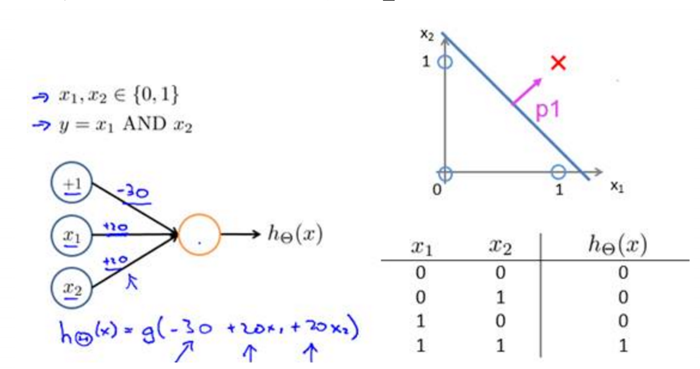

#人工神经网络
##神经网络基本结构图示

##从逻辑回归到神经元感知器


##增多中间层变为深度神经网络

##神经网络应用
* 神经网络应用在分类问题中效果好
* 神经网络用于非线性可分问题效果好于LR与SVM
* 对线性分类器的『与』和『或』的组合可以很好对平面样本点分布进行分类
* 在很多分类问题中，样本是不可线性切分的，那特征的处理就尤为重要了，而这正是神经网络所擅长的，在每一次的前向计算过程中，就在自动地做feature mapping，而到达softmax层的时候，其实构造出来的feature空间里，样本已经是能近似线性切分的了，于是三下五除二把其他分类器远远甩在后面了。

###神经网络处理『与』和『或』
####神经元完成『逻辑与』


####神经元完成『逻辑或』

####Example

####神经网络决策区域

###神经网络的传递函数

###BP神经网络图示
* “正向传播”求损失，“反向传播”回传误差
* 根据误差信号修正每层的权重

###BP神经网络基本公式

* 如何调整权重让误差不断减小？
* 随机梯度下降法计算梯度

##简单人工神经网络对样本点做非线性切分代码实现
1. 生成一个随机样本点分布
```python
import numpy as np
from sklearn.datasets import make_moons
import matplotlib.pyplot as plt
# 手动生成一个随机的平面点分布，并画出来
np.random.seed(0)
X, y = make_moons(200, noise=0.20)
plt.scatter(X[:,0], X[:,1], s=40, c=y, cmap=plt.cm.Spectral)
# plt.show()
```
####简单神经网络基本结构


* 这是一个分类问题，因此我们用softmax分类器(LR的多分类)，并且用互熵损失作为损失函数、

* BP计算梯度使用(随机)梯度下降

* 实现代码如下：
```python
# 完整的训练建模函数定义
def build_model(nn_hdim, num_passes=20000, print_loss=False):
    '''
    参数：
    1) nn_hdim: 隐层节点个数
    2）num_passes: 梯度下降迭代次数
    3）print_loss: 设定为True的话，每1000次迭代输出一次loss的当前值
    '''
    # 随机初始化一下权重呗
    np.random.seed(0)
    W1 = np.random.randn(nn_input_dim, nn_hdim) / np.sqrt(nn_input_dim)
    b1 = np.zeros((1, nn_hdim))
    W2 = np.random.randn(nn_hdim, nn_output_dim) / np.sqrt(nn_hdim)
    b2 = np.zeros((1, nn_output_dim))
 
    # 这是咱们最后学到的模型
    model = {}
     
    # 开始梯度下降...
    for i in xrange(0, num_passes):
 
        # 前向运算计算loss
        z1 = X.dot(W1) + b1
        a1 = np.tanh(z1)
        z2 = a1.dot(W2) + b2
        exp_scores = np.exp(z2)
        probs = exp_scores / np.sum(exp_scores, axis=1, keepdims=True)
 
        # 反向传播
        delta3 = probs
        delta3[range(num_examples), y] -= 1
        dW2 = (a1.T).dot(delta3)
        db2 = np.sum(delta3, axis=0, keepdims=True)
        delta2 = delta3.dot(W2.T) * (1 - np.power(a1, 2))
        dW1 = np.dot(X.T, delta2)
        db1 = np.sum(delta2, axis=0)
 
        # 加上正则化项
        dW2 += reg_lambda * W2
        dW1 += reg_lambda * W1
 
        # 梯度下降更新参数
        W1 += -epsilon * dW1
        b1 += -epsilon * db1
        W2 += -epsilon * dW2
        b2 += -epsilon * db2
         
        # 得到的模型实际上就是这些权重
        model = { 'W1': W1, 'b1': b1, 'W2': W2, 'b2': b2}
         
        # 如果设定print_loss了，那我们汇报一下中间状况
        if print_loss and i % 1000 == 0:
          print "Loss after iteration %i: %f" %(i, calculate_loss(model))
     
    return model
# 判定结果的函数
def predict(model, x):
    W1, b1, W2, b2 = model['W1'], model['b1'], model['W2'], model['b2']
    # 前向运算
    z1 = x.dot(W1) + b1
    a1 = np.tanh(z1)
    z2 = a1.dot(W2) + b2
    exp_scores = np.exp(z2)
    # 计算概率输出最大概率对应的类别
    probs = exp_scores / np.sum(exp_scores, axis=1, keepdims=True)
    return np.argmax(probs, axis=1)
# 建立3个隐层的神经网络
model = build_model(3, print_loss=True)
 
# 然后再把决策/判定边界画出来
plot_decision_boundary(lambda x: predict(model, x))
plt.title("Decision Boundary for hidden layer size 3")
plt.show()
```
####结果

# RNN与LSTM
##RNN应用
* 循环神经网络（Recurrent Neural Network, RNN）是一类以序列（sequence）数据为输入，在序列的演进方向进行递归（recursion）且所有节点（循环单元）按链式连接的递归神经网络（recursive neural network）
* 自然语言数据是典型的序列数据，因此对序列数据学习有一定优势的循环神经网络在NLP问题中取得了较好的应用效果。在语音识别（speech recognition）中，循环神经网络可被应用于端到端（end-to-end）建模，例如有研究使用LSTM单元构建的双向深度循环神经网络成功进行了英语文集TIMIT的语音识别，其识别准确率超过了同等条件的隐马尔可夫模型（Hidden Markov Model, HMM）和深度前馈神经网络
* 基于上下文连接的循环神经网络，被大量用语言建模（language modeling）问题 。有研究在字符层面（character level）的语言建模中，将循环神经网络与卷积神经网络相结合并取得了良好的学习效果 。循环神经网络也是语义分析（ sentiment analysis）的工具之一，被应用于文本分类、社交网站数据挖掘等场合。
* 在语音合成（speech synthesis）领域，有研究将多个双向LSTM相组合建立了低延迟的语音合成系统，成功将英语文本转化为接近真实的语音输出。循环神经网络也被用于端到端文本-语音（Text-To-Speech, TTS）合成工具的开发，例子包括Tacotron、Merlin等。
## RNN与传统神经网路和CNN的不同
* RNN引入“记忆”的概念，循环2字来源于其每个元素都执行相同的任务。但是输出依赖于 输入 和 “记忆”
###RNN的结构

* X(t) 是时间t处的输入
* S(t) 是时间t处的“记忆”，S(t) =f(UX(t) +WS(t-1))，f可以是tanh等
* O(t) 是时间t出的输出，比如是预测下个词的话，可能是softmax输出的属于每个候选词的概率
###RNN的结构细节
* 可以把隐状态S(t) 视作“记忆体”，捕捉了之前时间点上
的信息。
* 输出O(t) 由当前时间及之前所有的“记忆”共同计算得到。
* 很可惜，实际应用中，S(t) 并不能捕捉和保留之前所有信
息（记忆有限）
* 不同于CNN，这里的RNN其实整个神经网络都共享一组参
数（U,V,W），极大减小了需要训练和预估的参数量
* 图中的O(t) 在有些任务下是不存在的，比如文本情感分析，
其实只需要最后的output结果就行
###LSTM的提出
* 存在长期依赖的问题如何解决？。
* 看电影的时候，某些情节的推断需要依赖很久以前的
一些细节。
* 很多其他的任务也一样。很可惜随着时间间隔不断增大时，RNN 会丧失学习到连接如此远的信息的能力。
* 也就是说，记忆容量有限，一本书从头到尾一字不漏
的去记，肯定离得越远的东西忘得越多。
* 怎么办——> LSTM
###LSTM与传统的RNN的不同
* LSTM是RNN一种，大体结构几乎一样。区别是？
* 它的“记忆细胞”改造过。
* 该记的信息会一直传递，不该记的会被“门”截断。
####传统RNN的结构

####LSTM的结构
* 记忆细胞变得复杂了一点

####记忆细胞的结构

* LSTM关键：“细胞状态”：细胞状态类似于传送带。直接在整个链上运行，只有一些少量的线性交互。信息在上面流传保持不变会很容易。

* LSTM怎么控制“细胞状态”？
* 通过“门”让信息选择性通过，来去除或者增加信息到细胞状态
* 包含一个sigmoid神经网络层 和 一个pointwise乘法操作
* Sigmoid 层输出0到1之间的概率值，描述每个部分有多少量可以通过。
* 代表“不许任何量通过”，1就指“允许任意量通过”


####第1步：决定从“细胞状态”中丢弃什么信息 => “忘记门”
* 比如完形填空中填“他”或者“她”的问题，细胞状态可能包
含当前主语的类别，当我们看到新的代词，我们希望忘记旧的
代词。

####第2步：决定放什么新信息到“细胞状态”中
* Sigmoid层决定什么值需要更新
* Tanh层创建一个新的候选值向量C(t)
* 上述2步是为状态更新做准备

####第3步：更新“细胞状态”
* 更新C(t-1) 为C(t)
* 把旧状态与f(t) 相乘，丢弃掉我们确定需要丢弃的信息
* 加上i(t) *C(t) 。这就是新的候选值，根据我们决定更新每个状态的程度进行变化。

####第4步：基于“细胞状态”得到输出
* 首先运行一个sigmoid 层来确定细胞状态的哪个部分将输出
* 接着用tanh处理细胞状态(得到一个在-1到1之间的值)，再将它和sigmoid门的输出相乘，输出我们确定输出的那部分。
* 比如我们可能需要单复数信息来确定输出“他”还是“他们”

##编程实现
[LSTM python实现](https://blog.csdn.net/jiangjingxuan/article/details/54729494)
#Word Embedding
##词嵌入的优点
###传统one-hot编码 ( “天气 ”: (1,0,0…,0)， “气候 ”:(0,1,0,…0) )
* 维度高（几千 – 几万维稀疏向量），数据稀疏
* 难以计算词之间相似度
* 难以做模糊匹配
###词嵌入
* 维度低（100 – 500维）
* 无监督学习，不需去掉停用词(stopwords)
* 天然有聚类后的效果
* 连续向量，方便机器学习模型处理
* 罕见词：“风姿绰约” ≈ “漂亮”
##Word2vec 简介
* Mikolov 2013, Distributed Representations of
Words and Phrases and their Compositionality
* 使用最广泛的词嵌入方法
* 速度快，效果好，容易扩展
* 原因：简单（Less is more）
## Word2vec 模型

##Word2vec 优化
* 两套词向量，使用时只保留一套
* 优化方法: 随机梯度递降(SGD)
* 每次扫描到一个词，算一下梯度，更新……
* 收敛很快。大语料：1、2个pass，小语料：1~10个pass
* Negative sampling: 近似分母（归一化系数
* 的梯度，提高效率
* Hierarchical softmax：提高效率，效果略差
##Word2vec 和矩阵分解的等价性（此部分实在看不懂）

##Word2vec 为何比大部分MF方法好
* SGD每次只更新碰到的词对
* 碰到的大部分是高频词对，低频词对很少碰到，更新的少
* 低频词对不会主导优化
* 阵分解(MF)方法，低频词对往往造成大的
误差，所以误导优化
##不同词嵌入算法性能比较

##影响词嵌入效果的因素
* 语料大小；语料和应用是否在同一领域
* 向量维度：语料大 →维度大。过大容易过拟合
* 上下文窗口: 3~7。过小: 捕捉模式太少;过大: 噪音太多。有加权: 窗口可大些


# 支持向量机
##基本公式

##这部分数学公式比较复杂目前只在概念层面和代码实现做了一些理解，数学层面的理解还很差。
##SVM python实现
* SVM虽然数学概念比较复杂，但是python实现却很简单
* 支持向量机有两种：SVC，支持向量分类，用于分类问题；SVR,支持向量回归，用于回归问题。
* 使用线性支持向量机对鸢尾花数据分类
```python
from sklearn import svm
svc = svm.SVC(kernel='linear')
# 鸢尾花数据集是sklearn自带的。
from sklearn import datasets
iris = datasets.load_iris()
# 只提取前面两列数据作为特征
X = iris.data[:, :2]
y = iris.target
# 基于这些数据训练出一个支持向量分离器SVC
svc.fit(X, y)
# 将预测结果可视化
from matplotlib.colors import ListedColormap
# 因为鸢尾花是3分类问题，我们要对样本和预测结果均用三种颜色区分开。
cmap_light = ListedColormap(['#FFAAAA', '#AAFFAA', '#AAAAFF'])
cmap_bold = ListedColormap(['#FF0000', '#00FF00', '#0000FF'])

def plot_estimator(estimator, X, y):
    '''
    这个函数的作用是基于分类器，对预测结果与原始标签进行可视化。
    '''
    estimator.fit(X, y)
    # 确定网格最大最小值作为边界
    x_min, x_max = X[:, 0].min() - .1, X[:, 0].max() + .1
    y_min, y_max = X[:, 1].min() - .1, X[:, 1].max() + .1
    # 产生网格节点
    xx, yy = np.meshgrid(np.linspace(x_min, x_max, 100),
                         np.linspace(y_min, y_max, 100))
    # 基于分离器，对网格节点做预测
    Z = estimator.predict(np.c_[xx.ravel(), yy.ravel()])

    # 对预测结果上色
    Z = Z.reshape(xx.shape)
    pl.figure()
    pl.pcolormesh(xx, yy, Z, cmap=cmap_light)

    # 同时对原始训练样本上色
    pl.scatter(X[:, 0], X[:, 1], c=y, cmap=cmap_bold)
    pl.axis('tight')
    pl.axis('off')
    pl.tight_layout()
    from matplotlib.colors import ListedColormap
# 因为鸢尾花是3分类问题，我们要对样本和预测结果均用三种颜色区分开。
cmap_light = ListedColormap(['#FFAAAA', '#AAFFAA', '#AAAAFF'])
cmap_bold = ListedColormap(['#FF0000', '#00FF00', '#0000FF'])

def plot_estimator(estimator, X, y):
    '''
    这个函数的作用是基于分类器，对预测结果与原始标签进行可视化。
    '''
    estimator.fit(X, y)
    # 确定网格最大最小值作为边界
    x_min, x_max = X[:, 0].min() - .1, X[:, 0].max() + .1
    y_min, y_max = X[:, 1].min() - .1, X[:, 1].max() + .1
    # 产生网格节点
    xx, yy = np.meshgrid(np.linspace(x_min, x_max, 100),
                         np.linspace(y_min, y_max, 100))
    # 基于分离器，对网格节点做预测
    Z = estimator.predict(np.c_[xx.ravel(), yy.ravel()])

    # 对预测结果上色
    Z = Z.reshape(xx.shape)
    pl.figure()
    pl.pcolormesh(xx, yy, Z, cmap=cmap_light)

    # 同时对原始训练样本上色
    pl.scatter(X[:, 0], X[:, 1], c=y, cmap=cmap_bold)
    pl.axis('tight')
    pl.axis('off')
    pl.tight_layout()
```
* 结果

* 正如我们所见，kernel="linear"（线性核函数）给了我们线性的决策边界：两类之间的分离边界是直线。
* 多分类的工作方式就是"one versus one" ：在任意两类样本之间设计一个SVM，因此k个类别的样本就需要设计k(k-1)/2个SVM。当对一个未知样本进行分类时，最后得票最多的类别即为该未知样本的类别。
* 线性支持向量分类器（LinearSVC）：对于线性核函数，有一个新的对象LinearSVC ，它使用了不同的算法。在某些数据集上运行地更快（比如稀疏数据集，文本挖掘就是典型的例子）。它对于多分类采用的是"one versus all"策略。
####支持向量与正则化
* 支持向量：就是最靠近分离边界的样本点。支持向量机的工作方式就是找到这些支持向量，它们被认为是在二分类问题中最具代表性的样本点。
* 为了更方便的可视化，我们选择二分类问题，也就是只考虑鸢尾花数据集中的1类和2类样本。这两类不是线性可分的，所以我们可以看到更有趣的一些东西。
* 支持向量的坐标可以通过方法support_vectors_来找到。我们在图中将对它们着重标记。
* 正则化 ：只考虑支持向量其实就是一种正则化的形式。实际上，它强迫模型在处理样本特征的时候变得更加简单。 This regularization can be tuned with the C parameter:
* 正则项可以通过调整系数 C 来决定：
* * 小的C值：将会有很多支持向量。决策边界=类别A的平均值-类别B的平均值
* * 大的C值：将会有较少的支持向量。决策边界是被大多数支持向量所决定。
#### 核方法
* 采用核方法，能够很方便地产生非线性分类边界。

* linear，线性核，会产生线性分类边界。一般来说它的计算效率最高，而且需要数据最少。
* poly ，多项式核，会产生多项式分类边界。
* rbf，径向基函数，也就是高斯核，是根据与每一个支持向量的距离来决定分类边界的。它的映射到无线维的。它是最灵活的方法，但是也需要最多的数据。高斯核更灵活，但是要注意过拟合的问题。
```python
svc = svm.SVC(kernel='linear')
plot_estimator(svc, X, y)
pl.scatter(svc.support_vectors_[:, 0], svc.support_vectors_[:, 1], s=80, facecolors='none', zorder=10)
pl.title('Linear kernel')

svc = svm.SVC(kernel='poly', degree=4)
plot_estimator(svc, X, y)
pl.scatter(svc.support_vectors_[:, 0], svc.support_vectors_[:, 1], s=80, facecolors='none', zorder=10)
pl.title('Polynomial kernel')

svc = svm.SVC(kernel='rbf', gamma=1e2)
plot_estimator(svc, X, y)
pl.scatter(svc.support_vectors_[:, 0], svc.support_vectors_[:, 1], s=80, facecolors='none', zorder=10)
pl.title('RBF kernel')
```
* 结果


#总结
* 以每次阅读的论文为轴学习其中涉及到的概念与算法
* 考虑到时间与精力，本学期学习的重点放在对概念的理解与算法的落地实现上
* 对数学知识的理解和学习放在寒假，集中时间精力补数学基础